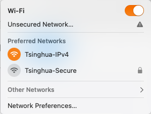
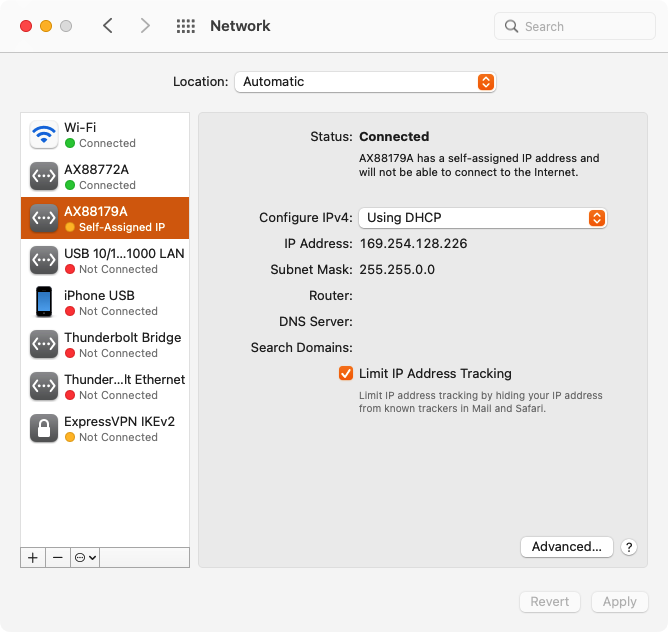
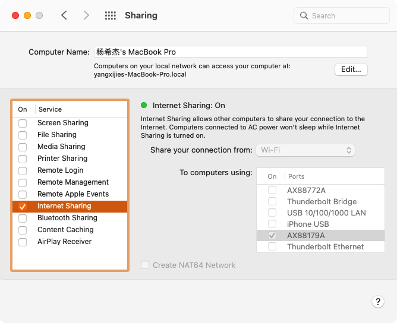
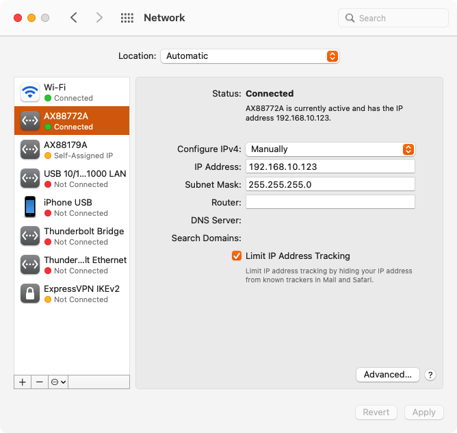

# 板卡共享macOS网络

> 在 macOS 12.6.1 x86_64 测试没问题
> 
> 板卡有两个网口，虽然正式使用的时候只需要一个，但是强烈推荐准备两个网线将两个网口都连接至电脑，以防万一连接不上。

## macOS通过无线网连接

打开 Wi-Fi，连接 `Tsinghua-IPv4`。注意这里不要连接 `Tsinghua-Secure`，因为这种连接方式加密导致电脑无法共享来自这个Wi-Fi的网络。



## 将板卡通过网线连接到电脑

将开发板的 `eth0` 通过网线连接到电脑。在连接上之后，打开 `System Preferences > Network`，可以看到多了一个 `AX88179A` 的网络在左侧边栏。点击之后，在右侧 `Configure IPv4` 选择 `Using DHCP`。注意这里一定要选择这个，如果自己去设置IP，会和之后的网络共享冲突。点击右下角 `Apply`。



## 打开网络共享

打开 `System Preferences > Sharing > Internet Sharing`，在 `Share your connection from:` 处选择 `Wi-Fi`，下面 `To computer using:` 处选择刚刚多出来的这个网络口 `AX88179A`。这样我们就把 `Wi-Fi` 共享给这条网线了。



打开终端，执行命令 `ifconfig`，可以看到多出了一个 `bridge100` 的网口：

```
bridge100: flags=8863<UP,BROADCAST,SMART,RUNNING,SIMPLEX,MULTICAST> mtu 1500
	options=3<RXCSUM,TXCSUM>
	ether a6:83:e7:72:2e:64
	inet 192.168.2.1 netmask 0xffffff00 broadcast 192.168.2.255
	inet6 fe80::a483:e7ff:fe72:2e64%bridge100 prefixlen 64 scopeid 0x15
	Configuration:
		id 0:0:0:0:0:0 priority 0 hellotime 0 fwddelay 0
		maxage 0 holdcnt 0 proto stp maxaddr 100 timeout 1200
		root id 0:0:0:0:0:0 priority 0 ifcost 0 port 0
		ipfilter disabled flags 0x0
	member: en6 flags=3<LEARNING,DISCOVER>
	        ifmaxaddr 0 port 27 priority 0 path cost 0
	nd6 options=201<PERFORMNUD,DAD>
	media: autoselect
	status: active
```

里面写了 IP地址为 `192.168.2.1` 子网掩码为 `255.255.255.0`。这相当于是共享路由器的IP，我们接下来要在开发板中设置这个路由器的IP。

## HiLinux修改配置

用 telnet 连接到板卡。这里请参考 [开发板连接电脑](../NIPC/connect.md)，使用另一路网线连接至开发板的网口。

我这里使用的网络连接为 `AX88772A (192.168.10.123)` - `eth1 (192.168.10.68)`，使用 `telnet 192.168.10.68` 连接开发板。



使用 `vi /etc/init.d/rcS` 修改开发板IP：

```
ifconfig lo 127.0.0.1
ifconfig eth1 192.168.10.68 netmask 255.255.255.0 up
ifconfig eth0 192.168.2.68  netmask 255.255.255.0 up
```

其中 `eth1` 不需要修改。将 `eth0` 的IP修改成 `192.168.2.x`，我这里使用的是 `192.168.2.68`。

保存退出。

使用命令 `reboot` 重启 HiLinux。

## 测试HiLinux网络

目前开发板还没有DNS，我们现在自己的电脑上使用 `ping baidu.com` 拿到百度服务器的地址 `110.242.68.66`：

```
$ ping baidu.com
PING baidu.com (110.242.68.66): 56 data bytes
64 bytes from 110.242.68.66: icmp_seq=0 ttl=49 time=309.452 ms
64 bytes from 110.242.68.66: icmp_seq=1 ttl=49 time=52.414 ms
^C
--- baidu.com ping statistics ---
```

再次使用 `telnet 192.168.10.68` 连接开发板。

使用下面的命令添加默认为路由电脑。

```
$ route
Kernel IP routing table
Destination     Gateway         Genmask         Flags Metric Ref    Use Iface
192.168.2.0     *               255.255.255.0   U     0      0        0 eth0
192.168.10.0    *               255.255.255.0   U     0      0        0 eth1
$ ip route add default via 192.168.2.1 dev eth0
$ route
Kernel IP routing table
Destination     Gateway         Genmask         Flags Metric Ref    Use Iface
0.0.0.0         192.168.2.1     0.0.0.0         UG    0      0        0 eth0
192.168.2.0     0.0.0.0         255.255.255.0   U     0      0        0 eth0
192.168.10.0    0.0.0.0         255.255.255.0   U     0      0        0 eth1
```

这样只要不是发给 `192.168.2.0` 和 `192.168.10.0` 的包，都会走默认网关。

```
$ ping 110.242.68.66
PING 110.242.68.66 (110.242.68.66): 56 data bytes
64 bytes from 110.242.68.66: seq=0 ttl=48 time=62.797 ms
64 bytes from 110.242.68.66: seq=1 ttl=48 time=59.012 ms
^C
--- 110.242.68.66 ping statistics ---
```

可以看到百度的服务器是可以ping通的，这说明开发板已经可以通过 macOS 的网络共享联网了。

## 将路由表写入启动文件

重启之后，路由 `0.0.0.0 192.168.2.1 0.0.0.0 UG 0 0 0 eth0` 会消失。

我们将 `ip route add default via 192.168.2.1 dev eth0` 这条命令添加到 `/etc/init.d/rcS` 中。

```
$ vi /etc/init.d/rcS
...
ifconfig lo 127.0.0.1
ifconfig eth1 192.168.10.68 netmask 255.255.255.0 up
ifconfig eth0 192.168.2.68  netmask 255.255.255.0 up
ip route add default via 192.168.2.1 dev eth0
...
```

## 添加DNS

TODO

## References

- https://apple.stackexchange.com/questions/186955/specific-network-settings-for-sharing-internet-connection
- http://kmahelona.blogspot.com/2013/04/share-your-internet-from-your-macbook.html
- https://discussions.apple.com/thread/250375975?answerId=250715933022#250715933022
- Linux添加默认网关 https://unix.stackexchange.com/questions/259045/how-to-set-the-default-gateway
