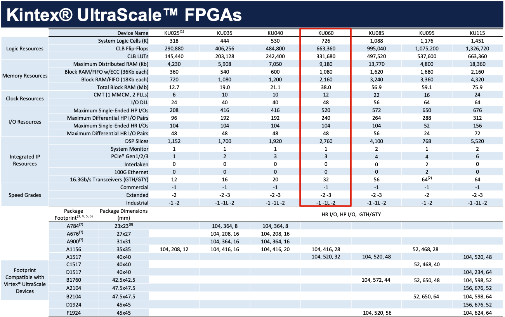

# 词汇解释

## NIPC

### NIPC

Neighbourhood Image Parallel Computing / 邻域图像并行计算

### NIPC-x

第x代邻域图像并行处理机

### NIPC开发板 / PCIE703

基于 UltraScale FPGA + 华为海思 ARM 的高性能综合视频图像处理平台

> PCIE703 是[北京青翼凌云科技有限公司](http://www.tsingetech.com)自主研制的一款基于 PCIE 总线架构的高性能综合视频图像处理平台，该平台采用 Xilinx 的高性能 Kintex UltraScale 系列 FPGA 加上华为海思的高性能视频处理器来实现。 -- PCIE703产品使用说明书

## HiLinux

### HiLinux

华为海思为音视频高速处理定制的Linux操作系统

### Hi3531 / Hi3531DV200

Hi3531D V200 是针对多路高清/超高清（1080p/4M/5M/4K）DVR产品应用开发的新一代专业SoC芯片。 Hi3531D V200集成了ARM A53四核处理器和性能强大的神经网络推理引擎，支持多种智能算法应用。同时，Hi3531D V200还集成了多路MIPI D-PHY接口输入，突破了数字接口的视频输入性能瓶颈，提供两倍于前代产品的视频输入能力。另外，H.265视频编解码引擎、视频图像处理的算法效果及性能得到了进一步提升。结合丰富的外围设备及高速接口，该SoC芯片为客户产品提供了高性能、优异图像质量的模拟高清DVR解决方案，广泛用于模拟高清监控市场和车载DVR市场 。 -- <https://www.hisilicon.com/cn/products/smart-vision/public-security/DVR/Hi3531DV200>

### ARM Cortex-A53

Arm Cortex-A53 MPCore Processor

> The Arm Cortex-A processor series is designed for devices undertaking complex compute tasks, such as hosting a rich operating system platform and supporting multiple software applications. Built as a low-power processor with 64-bit capabilities, the Cortex-A53 processor is applicable in a range of devices requiring high performance in power-constrained environments. -- <https://www.arm.com/en/products/silicon-ip-cpu/cortex-a/cortex-a53>

> The Cortex-A53 processor is a mid-range, low-power processor that implements the Armv8-A architecture. The Cortex-A53 processor has one to four cores, each with an L1 memory system and a single shared L2 cache. -- DDI0500J_cortex_a53_trm.pdf Arm Cortex-A53 MPCore Processor Technical Reference Manual

## FPGA

### FPGA

Field Programmable Gate Array / 现场可编程逻辑门阵列

### Xilinx UltraScale

<https://china.xilinx.com/products/silicon-devices/fpga/kintex-ultrascale.html#documentation>

> Xilinx UltraScale architecture comprises high-performance FPGA, MPSoC, and RFSoC families that address a vast spectrum of system requirements with a focus on lowering total power consumption through numerous innovative technological advancements. --  ds890-ultrascale-overview.pdf UltraScale Architecture and Product Data Sheet: Overview by AMD Xilinx

### Kintex UltraScale FPGAs

> High-performance FPGAs with a focus on price/performance, using both monolithic and next-generation stacked silicon interconnect (SSI) technology. High DSP and block RAM-to-logic ratios and next-generation transceivers, combined with low-cost packaging, enable an optimum blend of capability and cost. -- ds890-ultrascale-overview.pdf UltraScale Architecture and Product Data Sheet: Overview by AMD Xilinx

### KU060 / XCKU060-2FFVA1517

-- ultrascale-fpga-product-selection-guide.pdf UltraScale FPGA Product Tables and Product Selection Guide P2

### Vivado

<https://china.xilinx.com/products/design-tools/vivado.html>

### DMA

> Direct memory access (DMA) is a feature of computer systems and allows certain hardware subsystems to access main system memory independently of the central processing unit (CPU). -- <https://en.wikipedia.org/wiki/Direct_memory_access>

## Video

### SDI

Serial Digital Interface / 数字分量串行接口

- SD-SDI
- HD-SDI 1080p30
- 3G-SDI 1080p60
- 6G-SDI
- 12G-SDI

### RF

radio-frequency / 射频

### BNC 接头

Bayonet Nut Connector

BNC 接头是监控工程中用于摄像设备输出时导线和摄像机的连接头，由 RGB 三原色信号及行同步、场同步五个独立信号接头组成。

### SMA 接口

SubMiniature version A

SMA 接口有两种形式，标准的 SMA 是一端“外螺纹+孔”，另一端“内螺纹+针”；反极性 RP-SMA 是一端“外螺纹+针”，另一端为“内螺纹+孔”。

### HDMI

High Definition Multimedia Interface / 高清多媒体接口

## Protocols

### SPI

Serial Peripheral Interface / 串行外设接口

### PCIe

> PCI Express (Peripheral Component Interconnect Express), officially abbreviated as PCIe or PCI-e, is a high-speed serial computer expansion bus standard... It is the common motherboard interface for personal computers' graphics cards, hard disk drive host adapters, SSDs, Wi-Fi and Ethernet hardware connections. -- <https://en.wikipedia.org/wiki/PCI_Express>

### HTTP

Hyper Text Transfer Protocol / 超文本传输协议

## Others

### Ubuntu

<https://ubuntu.com>

基于Linux内核的发行版（目前最新的版本为 Ubuntu 22.04.1 LTS）

### Ubuntu LTS

Ubuntu操作系统长期支持的版本（LTS - Long Time Support）
