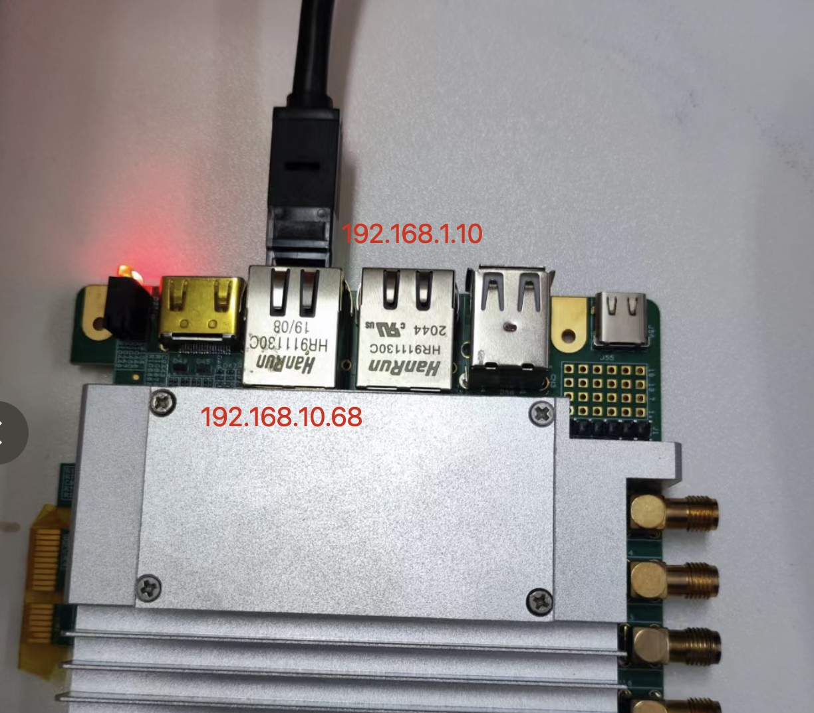
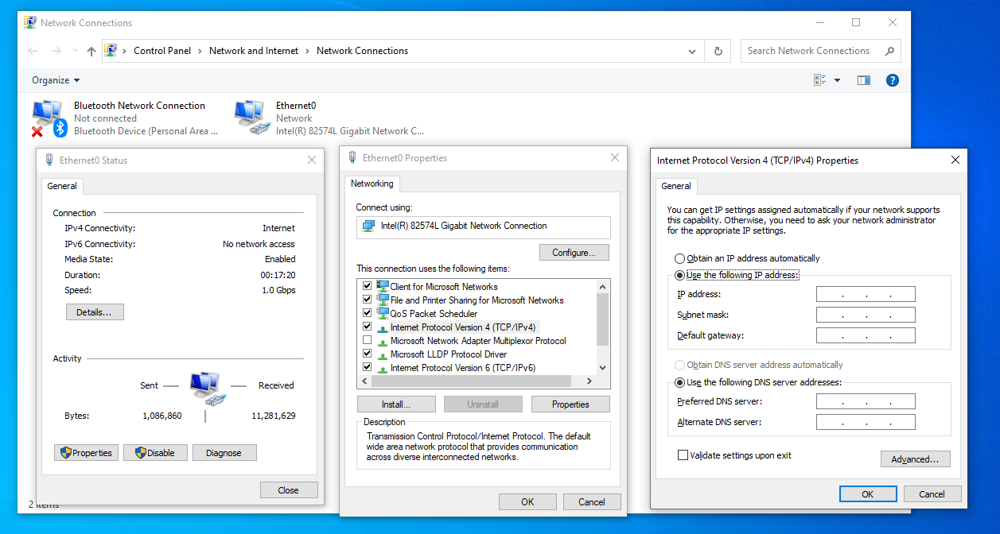
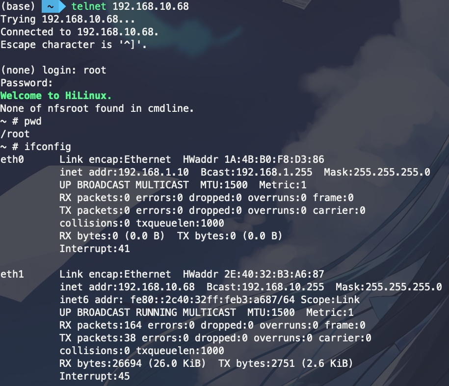

# 开发板通过网络连接电脑

## 有线

板卡ARM端有两个接口，默认 IP 如下：

### macOS

需要使用电脑连接，则需要先通过网线将板卡和电脑连接到一起；然后在电脑中设置IP地址为同一网段，如 `192.168.1.123` 或 `192.168.10.123`，子网掩码 `255.255.255.0`：

点击右下角 `Apply`。

### Windows

打开 `设置 > Network & Internet > Change adapter options`，打开之后选择对应的网口，双击。

打开 `Properties`，双击 `Internet Protocol Version 4 (TCP/IPv4)`。在 `General` 下选择 `Use the following IP address`，填写即可。

点击右下角 `OK`。

---

然后使用telnet连接即可：

## 无线

当有两个及以上的板子，使用一个无线路由器会更省事儿。

这里使用的是小米无线路由器，插上电源后浏览器打开 mifiwi.com (192.168.31.1)，然后可以进行初始化。初始化结束后，插入校园网的网线，电脑即可上网。

要连接板子，需要将 IP 地址设置为同一网段。这里两个板靠近 Type-C 的网口都设置为 192.168.1.68，方便有线调试；第一个板靠近 HDMI 的口使用 192.168.31.100，第二个靠近 HDMI 的网口设置为 192.168.31.101，这两个网口通过网线连接至路由器。

这时在电脑上就可以直接无线访问 192.168.31.100 和 192.168.31.101 来访问板子了。

注：如果要让板子也连接外网，应该要配置 DNS、转发规则等。
