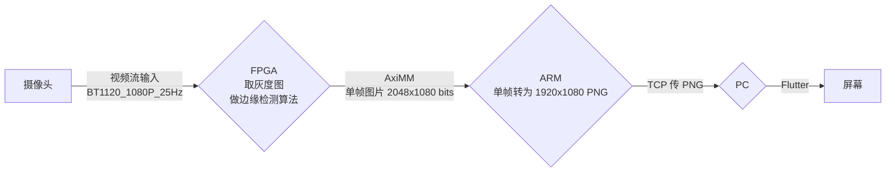

# 视频+边缘检测

## 相关链接

- [Bilibili 讲解视频（最新版本）](TODO)
- [算法仿真 Python+OpenCV](https://github.com/NIPC-Project/edge-opencv)
- [Vivado 工程文件夹](TODO)
- [HiLinux 端服务器 Python+ctypes](https://github.com/NIPC-Project/edge-hilinux)
- [PC 客户端 Flutter](https://github.com/NIPC-Project/edge-pc)

> [Bilibili 讲解视频（旧版 已归档）](https://www.bilibili.com/video/BV1wo4y1v7Ue/)

## 数据流

