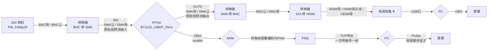

# 视频+直通

这个工程将摄像头接入 FPGA，然后将视频流数据不加任何处理传至 HiLinux，HiLinux 再传至 PC，PC 在屏幕上持续显示摄像头的画面。基于 Vivado 工程 pcie703SdiCameraDDRDemo。

## 摄像头

使用的摄像头为 [HD-SDI 数字高清彩色方型摄像机](https://m.tb.cn/h.U6t0ZPB?tk=N5s2dcaIbkv)，输出视频 PAL-1080P25帧每秒。

摄像头有三个接口，分别是：

- 红色 POWER
    - 电源
    - 接 DC12V 1A
- 绿色 HD-SDI
    - HD-SDI 高清数字接口
    - BNC 母接头
- 黄色 VIDEO（不使用）
    - CVBS 模拟输出（符合 SMPTE 292M 标准）
    - BNC 母接头

### 确定摄像头正常工作（非必需）

摄像头的绿色线为 BNC 母头，因此可以选取 [BNC 公头转 BNC 公头的数字线缆](https://m.tb.cn/h.UkIuyzh?tk=QJF5dfOI8pd) 接入一个 [SDI 转 HDMI 的转换器](https://m.tb.cn/h.U9WcZ8W?tk=1IHXdfOrhsS)，然后直接使用 [HDMI 双头线](https://item.m.jd.com/product/6079846.html?gx=RnE2l29cOWHay9RP--tzXYzsmLrDjI43RTK4&ad_od=share&utm_source=androidapp&utm_medium=appshare&utm_campaign=t_335139774&utm_term=CopyURL)接入电视。

没有电视的话可以购买一个[视频采集卡](https://item.m.jd.com/product/100013253153.html?gx=RnE2l29cOWHay9RP--tzXYzsmLrDjI43RTK4&ad_od=share&utm_source=androidapp&utm_medium=appshare&utm_campaign=t_335139774&utm_term=CopyURL)，将 HDMI 插入采集卡，再用采集卡接入电脑，使用电脑上的录制软件（如 OBS），选择输入源。

旋转摄像头调整焦距，查看到摄像头画面即说明摄像头正常工作。

### 接入板子

板子上的视频输出接口为 SMA 母头，因此最简单的接入方式是购买一个 [SMA公 转 BNC公 (SMA/BNC-JJ) 的接头](https://m.tb.cn/h.U9BYSNN?tk=fOEodfOHDJe)，将摄像头连接至板子即可。

## NIPC-5 开发板接口

- FPGA
    - 3G-SDI 输入 x 8（`IN0` / `IN1` / `IN2` / `IN3` / `IN4` / `IN5` / `IN6` / `IN7`）
    - 3G-SDI 输出 x 2（`OUT0` / `OUT1`）
- ARM
    - HDMI x 1
    - NET x 2（`NET`）

## 单摄像头直通

### 框图

### 注意

- 从 OUT0 输出的视频流用于调试。
- 视频流可以被理解为时间上连续的多张单帧图像，也就是暂时不考虑视频编码。
- JPEG 的编码压缩率应该可根据网络传输速率选择。
- 现阶段只考虑单 PC 查看摄像头实时的内容，不考虑单对多的直播。

### 文档

主要需要看 SMPTE SD HD 3G-SDI 3.0.pdf。

## 双摄像头直通

- 将上面的架构添加一路摄像头即可。SMA 射频输出口共两个，提供两个摄像头的直通视频流供调试使用。
- 如果两路视频传回 PC 使用同一个端口，那么应该在 ARM 端将两帧图像合二为一。
- 如果两路视频使用不同的端口，Flutter 应该添加按钮用来添加或删除视频流显示面板，每路视频选择各自的端口和存储路径。
