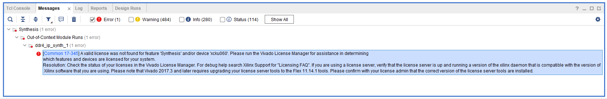

# 安装License

如果没有LICENSE，直接生成比特流，会报错：



```
[Common 17-345] A valid license was not found for feature 'Synthesis' and/or device 'xcku060'. Please run the Vivado License Manager for assistance in determining
which features and devices are licensed for your system.
Resolution: Check the status of your licenses in the Vivado License Manager. For debug help search Xilinx Support for "Licensing FAQ". If you are using a license server, verify that the license server is up and running a version of the xilinx daemon that is compatible with the version of Xilinx software that you are using. Please note that Vivado 2017.3 and later requires upgrading your license server tools to the Flex 11.14.1 tools. Please confirm with your license admin that the correct version of the license server tools are installed.
```

可以试用也可以花钱买……

我这里是直接拿到了一个License文件：`xilinx_ise_vivado.lic`

搜索 `license`，打开 `Manage Xilinx Licenses 2018.3`，

左侧 `Get License > Load License`，点击右侧 `Copy License...` 选择 `xilinx_ise_vivado.lic` 导入就行了。
