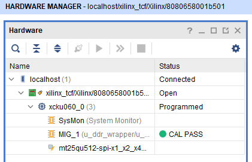
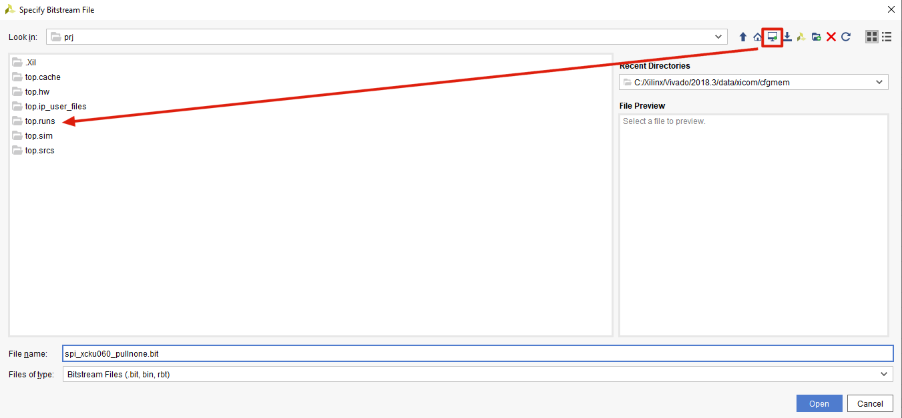

# 烧录到FPGA

以工程 `pcie703Hi3531Img` 这个工程为例：

打开 `prj` 文件夹，双击 `top.xpr` 即可打开这个工程。

首先点击左侧的 `PROGRAM AND DEBUG > Generate Bitstream`。这里如果提示 `Bitstream generation has already completed and is up-to-date. Re-run anyway?`，说明比特流已经是最新的了，选择 `Cancel`。

点击左侧的 `PROGRAM AND DEBUG > Open Hardware Manager > Open Target > Auto Connect`

连接上之后点击左侧 `PROGRAM AND DEBUG > Open Hardware Manager > Program Device > xcku060_0`。弹出的框，`Bitstream file` 点击右侧的省略号，点击左上角第三个电脑加一个绿点的图标跳转到当前的工程目录，点击左侧 `top.runs > impl_1 > top_wrapper.bit`，点击 `OK`，点击 `Program` 即可开始烧录。

烧录完成之后，需要在 HiLinux 重启设备，使用 `reboot` 命令即可。
